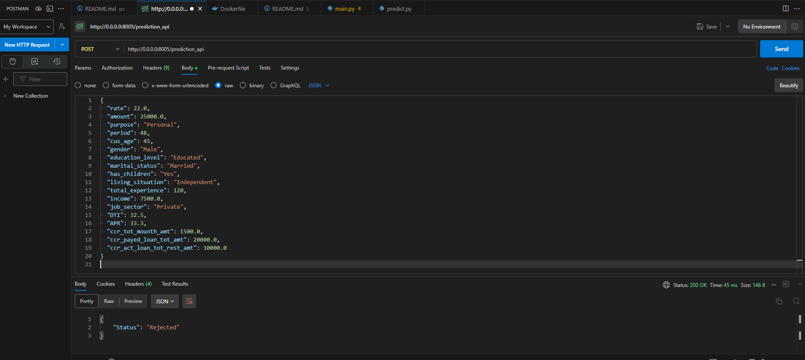

## Docker Commands

This section outlines the steps to containerize and deploy the Credit Decision Model application using Docker.

### Prerequisites

- Docker installed on your machine.
- Docker Hub account (replace `<username>` with your Docker Hub username).

### Building the Docker Image

Build the Docker image from the Dockerfile in the current directory:

```bash
docker build -t <username>/credit_decision_model:latest .
```

### Pushing the Docker Image to Docker Hub

Push the built Docker image to your Docker Hub repository:

```bash
docker push <username>/credit_decision_model:latest
```

### Running the Docker Container

Run the Docker container in detached mode, mapping the container's port to a port on the host:

```bash
docker run -d -it --name credit_model_container -p 8005:8005 <username>/credit_decision_model:latest bash
```

### Executing Commands in the Running Container

Execute the training pipeline script within the container:

```bash
docker exec credit_model_container python prediction_model/training_pipeline.py
```

Run pytest inside the container, generating a report named PytestResults.xml:

```bash
docker exec credit_model_container pytest -v --junitxml PytestResults.xml --cache-clear
```

### Copying Files from the Container to the Host

Copy the PytestResults.xml file from the container to your host machine:

```bash
docker cp credit_model_container:/code/src/PytestResults.xml .
```

### Running the FastAPI Application Inside the Container

Start the FastAPI application using Uvicorn within the container:

```bash
docker exec -d -w /code credit_model_container uvicorn main:app --proxy-headers --host 0.0.0.0 --port 8005
```

Alternatively, you can directly execute the main Python file if it's set up to run Uvicorn:

```bash
docker exec -d -w /code credit_model_container python main.py
```

This will start the FastAPI application, making it accessible at http://localhost:8005/docs on your local machine.

Replace <username> with your Docker Hub username in the commands above. This setup allows for easy deployment and testing of the Credit Decision Model application within a Dockerized environment.


## Testing the FastAPI Application

Once the application is running, you can send POST requests to the `/prediction_api` endpoint with the appropriate JSON payload. Below is an example using Postman to send a request and receive a prediction response:



The example JSON payload for the request is:

```json
{
  "rate": 22.0,
  "amount": 25000.0,
  "purpose": "Personal",
  "period": 48,
  "cus_age": 45,
  "gender": "Male",
  "education_level": "Educated",
  "marital_status": "Married",
  "has_children": "Yes",
  "living_situation": "Independent",
  "total_experience": 120,
  "income": 7500.0,
  "job_sector": "Private",
  "DTI": 32.5,
  "APR": 33.3,
  "ccr_tot_mounth_amt": 1500.0,
  "ccr_payed_loan_tot_amt": 20000.0,
  "ccr_act_loan_tot_rest_amt": 10000.0
}

```