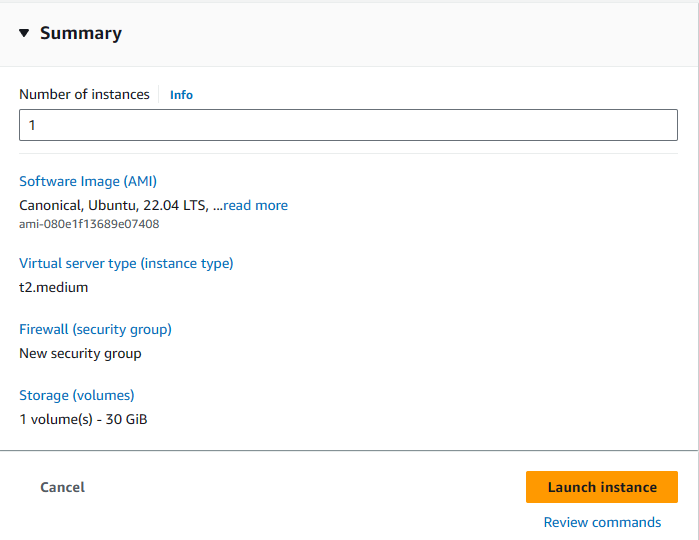

## Docker Commands

This section outlines the steps to containerize and deploy the Credit Decision Model application using Docker.

### Prerequisites

- Docker installed on your machine.
- Docker Hub account (replace `<username>` with your Docker Hub username).

### Building the Docker Image

Build the Docker image from the Dockerfile in the current directory:

```bash
docker build -t <username>/credit_decision_model:latest .
```

### Pushing the Docker Image to Docker Hub

Push the built Docker image to your Docker Hub repository:

```bash
docker push <username>/credit_decision_model:latest
```

### Running the Docker Container

Run the Docker container in detached mode, mapping the container's port to a port on the host:

```bash
docker run -d -it --name credit_model_container -p 8005:8005 <username>/credit_decision_model:latest bash
```

### Executing Commands in the Running Container

Execute the training pipeline script within the container:

```bash
docker exec credit_model_container python prediction_model/training_pipeline.py
```

Run pytest inside the container, generating a report named PytestResults.xml:

```bash
docker exec credit_model_container pytest -v --junitxml PytestResults.xml --cache-clear
```

### Copying Files from the Container to the Host

Copy the PytestResults.xml file from the container to your host machine:

```bash
docker cp credit_model_container:/code/src/PytestResults.xml .
```

### Running the FastAPI Application Inside the Container

Start the FastAPI application using Uvicorn within the container:

```bash
docker exec -d -w /code credit_model_container uvicorn main:app --proxy-headers --host 0.0.0.0 --port 8005
```

Alternatively, you can directly execute the main Python file if it's set up to run Uvicorn:

```bash
docker exec -d -w /code credit_model_container python main.py
```

This will start the FastAPI application, making it accessible at http://localhost:8005/docs on your local machine.

Replace <username> with your Docker Hub username in the commands above. This setup allows for easy deployment and testing of the Credit Decision Model application within a Dockerized environment.


## Testing the FastAPI Application

Once the application is running, you can send POST requests to the `/prediction_api` endpoint with the appropriate JSON payload. Below is an example using Postman to send a request and receive a prediction response:


The example JSON payload for the request is:


```json
{
  "rate": 22.0,
  "amount": 25000.0,
  "purpose": "Personal",
  "period": 48,
  "cus_age": 45,
  "gender": "Male",
  "education_level": "Educated",
  "marital_status": "Married",
  "has_children": "Yes",
  "living_situation": "Independent",
  "total_experience": 120,
  "income": 7500.0,
  "job_sector": "Private",
  "DTI": 32.5,
  "APR": 33.3,
  "ccr_tot_mounth_amt": 1500.0,
  "ccr_payed_loan_tot_amt": 20000.0,
  "ccr_act_loan_tot_rest_amt": 10000.0
}

```

## AWS EC2 Instance Setup for MLOps




To ensure that our MLOps pipeline is robust and scalable, we leverage AWS EC2 instances. This section guides you through the setup of an EC2 instance which will serve as the host for our Docker and Jenkins installations.

### Prerequisites

- An active AWS account
- Access permissions to manage EC2 instances within your AWS account

### Launching an EC2 Instance

1. **AMI Selection**: We start by selecting an Ubuntu Server image; for this project, we used "Ubuntu 22.04 LTS" for its stability and long-term support.

2. **Instance Type**: Choose a `t2.medium` instance type. This instance provides an optimal balance between compute, memory, and networking resources, and is suitable for medium-level workloads.

3. **Instance Configuration**: By default, we launch a single instance. Adjust the network settings or roles as required by your project's needs.

4. **Storage Setup**: Attach a minimum of 30 GiB storage to ensure sufficient space for all our Docker images, Jenkins configurations, and other essential data.

5. **Security Group Settings**: We establish a new security group with rules that allow SSH access. Ensure to also allow traffic on port 8080 for Jenkins, and any other ports your services may need.

6. **Review & Launch**: Confirm that all configurations are correct, and proceed to launch your instance.

### Accessing Your Instance

Post-launch, you'll be prompted to choose an existing key pair or create a new one. This key pair is critical for SSH access into your EC2 instance securely.

Here's a sample command to SSH into your instance:

```bash
ssh -i /path/to/your-key.pem ubuntu@<Your-EC2-Instance-Public-DNS>

```


